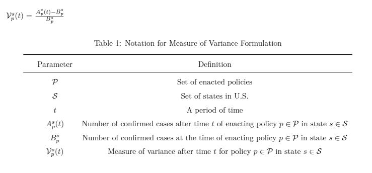

## Analyzing the Effect of Social Distancing Policies Enactment Time on Spread of COVID-19
### By Narges Ahani and Amorn Chokchaisiripakdee, Worcester Polytechnic Institute

### Link to Project Visualization: http://NargesAhani.github.io/index.html
### Link to Project Screen-Cast: https://www.youtube.com/watch?v=gqzsABTkHcU
### Link to https://github.com/NargesAhani/NargesAhani.github.io/blob/master/CS%20573%20Process%20Book.pdf

In late 2019, Coronavirus and the disease caused by it, COVID-19 started to grow rapidly around the world. World Health Organization declared it a pandemic on March 11th, 2020 and many countries including United States declared the State of Emergency afterward.

In the absence of a vaccine or an effective treatment, the only way for governments to slow down the spread of the virus is to put aggressive actions and policies aimed at reducing the contact of people and scaling down the likelihood that the virus is transmitted from person to person.

States have taken several actions at different points of time. So, our main questions are: 
	Is the time of enacting a policy really effect on the spread of virus? 
	Is it true that states which reacted later had more difficulties on controlling the 	disease compared to others?

The policies that we studied in this project are:
1. Mandatory stay at home orders 
2. Closures of non-essential businesses
3. bans on large gatherings
4. School closures 
5. Limits on bars and restaurants 

To answer our questions, we want to see two major indices:

First: “when exactly a policy was enacted in a state” 

Second: “how much increase (as a ratio) were observed after the enactment time” 

So, our visualization consists of two parts:
The First part is the time of enacting a policy in each state.

The horizontal axis is the time window and the vertical axis is the name of states and dots with different colors represent different policies. In this visualization we can easily see when each policy enacted in each state.

The second part is to see what the variance is after enacting a policy. 
To calculate the variance, we come up with our own measure called “ratio of increase after one week”.

For example, ratio of increase equals 1 means that the number of confirmed cases were double one week after enacting a policy and 2 means it tripled.

Here we have all states shown as half pie charts and for each state we have 5 slices for the 5 policies. The length of each slice shows the ratio of increase for corresponding policy.

Hovering on dots on the left panel, only the data associated with that policy pops up in the entire graph. In this way we can compare different states to see if enacting that policy, earlier or later, effected on the ratio of increase shown at right graph.

After exploring in the visualized data, we conclude that there is no significant effect, neither positive nor negative, between the enactment time of policies and the spread of the virus in different states.
This implies that, more or less, states took action at the right time, and other natural factors such as population, density or lifestyle in states, had the major effect on the spread of virus.
 

